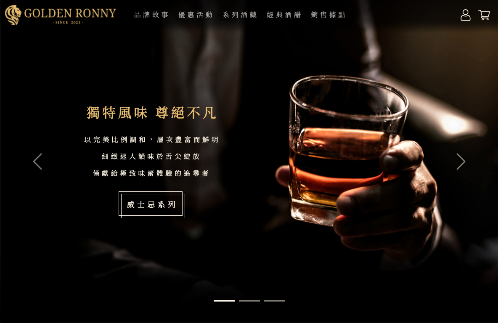
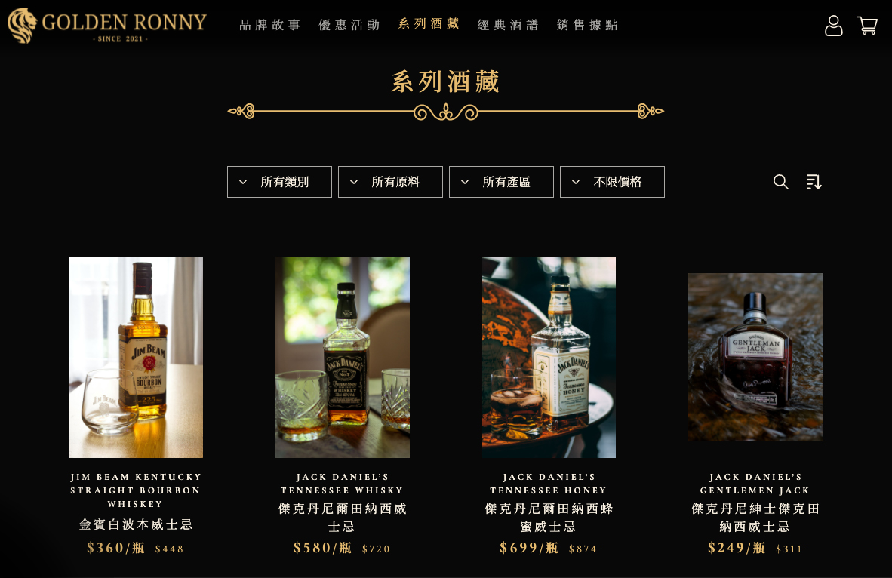
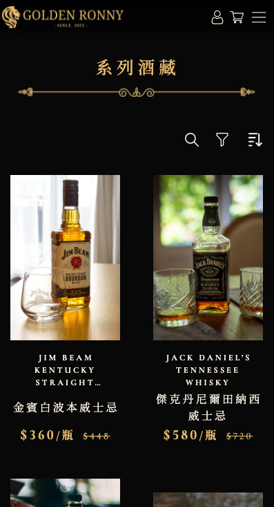

# Golden Ronny

Frontend demo of E-commerce liquor store website built with `vue` / `vue-cli` / `vue-router`.

Highly customed `Bootstrap` theme. Fully RWD.

[Demo link](https://zasper32171.github.io/golden_ronny/)





Packages:

- `axios` & `vue-axios`
- `vue3-loading-overlay`
- `vee-validator`

## Project setup

#### Fill in `.env`

```
VUE_APP_API_BASE_URL = https://your_base_url.com
VUE_APP_API_PATH     = your_api_path
```

#### Get packages

```
npm install
```

#### Compiles and hot-reloads for development

```
npm run serve
```

#### Compiles and minifies for production

```
npm run build
```

## Populate data

#### Fill in `data/.env`

```
BASE_URL       = https://your_base_url.com
API_PATH       = your_api_path
ADMIN_USERNAME = your_username@mail.com
ADMIN_PASSWORD = your_password
```

#### Get required libraries

```
pip3 install -r data/requirements.txt
```

#### Inject data into database

```
./data/populate.sh
```

#### Clear all data

```
./data/depopulate.sh
```
